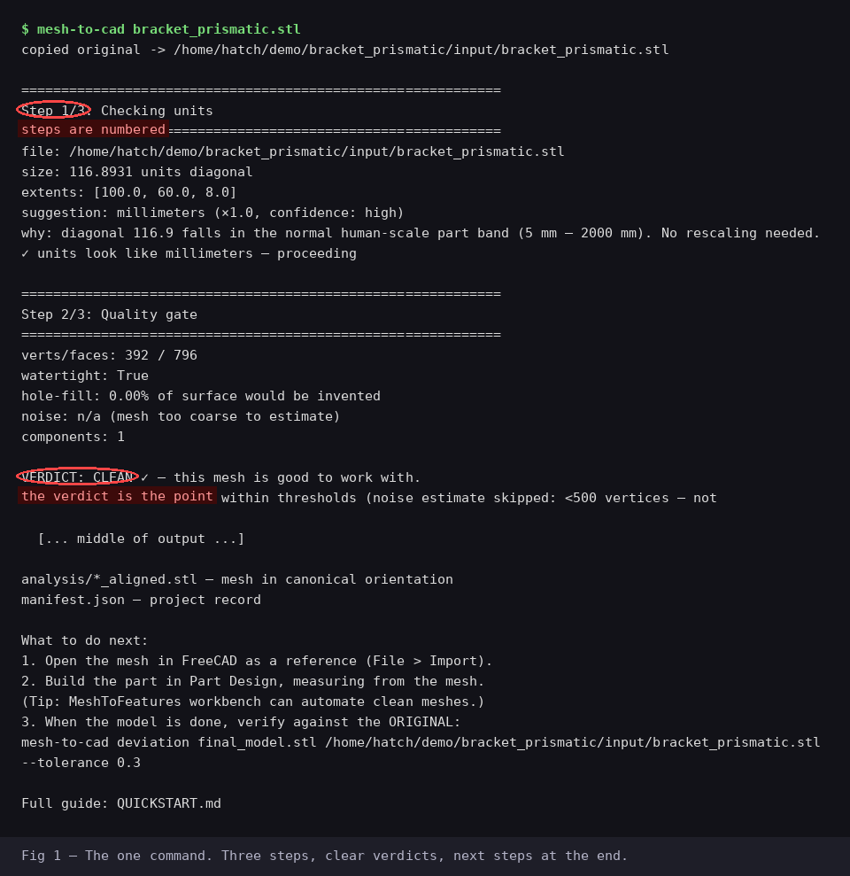
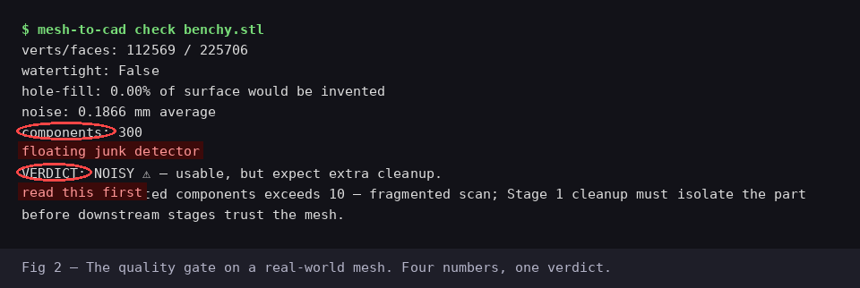
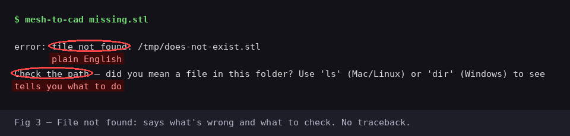
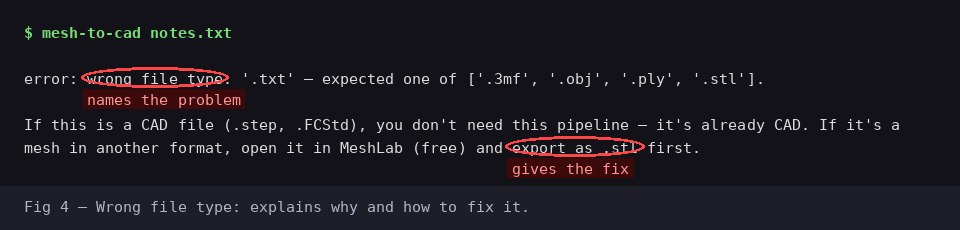

# QUICKSTART — mesh-to-cad

**You only need to learn one command.** Everything else is optional.

```bash
mesh-to-cad your_file.stl
```

That's it. That runs the whole pipeline: it checks your file's units,
tests whether the mesh is good enough to work with, measures everything
about it, and tells you what to do next.

> **🔒 Your files never leave your computer.** No account, no cloud, no
> telemetry, no phoning home. Everything runs locally — that's not a
> feature, it's the architecture. See [SECURITY.md](SECURITY.md) for the
> full statement.

This guide assumes you've never used a command line before. If you have,
skip to [The one command](#the-one-command).

---

## Before you start

**What this tool does:** takes a 3D scan (or a downloaded STL) and helps
you turn it into real, editable CAD. It doesn't do the CAD for you — it
measures the mesh, judges its quality, and tells you exactly what you're
working with, in numbers.

**What this tool does NOT do:**
- It does not send your files anywhere. Everything runs on your computer.
  No accounts, no telemetry, no phoning home. Privacy is a core design
  principle, not a setting — see [SECURITY.md](SECURITY.md).
- It does not need a GPU.
- It does not modify your original file. Ever. It works on copies.

**What you need installed:** Python 3.10+, four Python packages, and
(optionally) CloudCompare for the final verification step. Full details —
OS support, hardware specs, download links — are in
[REQUIREMENTS.md](REQUIREMENTS.md). The short version is below.

---

## Step 0: Installation (do once)

### 1. Install Python

- **Windows / Mac:** download from https://www.python.org/downloads/
  (get 3.10 or newer). On Windows, **check the box that says "Add Python
  to PATH"** during installation — this is the step everyone misses.
- **Linux:** it's probably already there. Check with:
  ```bash
  python3 --version
  ```
  If it says 3.10 or higher, you're good.

### 2. Download mesh-to-cad

```bash
git clone https://github.com/GruntAndMuse/mesh-to-cad.git
cd mesh-to-cad
```

No git? Download the ZIP from the GitHub page and unzip it, then open
a terminal in that folder.

### 3. Set up the Python environment (do once)

```bash
python3 -m venv .venv
```

**Windows:** if `python3` doesn't work, try `python` instead:
```cmd
python -m venv .venv
```

Then install the required packages:
```bash
.venv/bin/pip install -r scripts/requirements.txt
```

**Windows:**
```cmd
.venv\Scripts\pip install -r scripts\requirements.txt
```

This downloads four small packages (trimesh, numpy, scipy, networkx).
Takes about a minute.

### 4. Verify it works

```bash
.venv/bin/python mesh-to-cad --help
```

**Windows:**
```cmd
.venv\Scripts\python mesh-to-cad --help
```

You should see the help text. If you see `No module named 'trimesh'`,
go back to step 3 — the packages didn't install.

> **Tired of typing `.venv/bin/python`?** Add the mesh-to-cad folder to
> your PATH (Windows users can use `mesh-to-cad.bat` instead). Then it's
> just `mesh-to-cad file.stl` from anywhere. See REQUIREMENTS.md for
> PATH setup on your OS.

### 5. (Optional) Install CloudCompare

Only needed for the final deviation check — you can run the whole
pipeline without it and install it later.

Download free from https://www.cloudcompare.org/. After installing,
verify your terminal can find it:
```bash
CloudCompare -SILENT
```
If it says "not found," add CloudCompare to your PATH, or note the
install location — you'll pass it with `--cc-bin` when the time comes.

---

## The one command

```bash
.venv/bin/python mesh-to-cad your_file.stl
```

Replace `your_file.stl` with your actual file. It accepts `.stl`,
`.ply`, `.obj`, and `.3mf`.

### What happens



The pipeline runs **three steps** and prints clear headers for each:

**Step 1/3: Checking units** — Measures your file and guesses whether
it's in millimeters, meters, or something else. This catches the classic
"everything is 1000x too small" mistake before it corrupts anything.
If the units aren't obviously millimeters, it **asks you to confirm**
before continuing. It never rescales silently.

**Step 2/3: Quality gate** — Four measurements of mesh quality:



- **Watertight:** does the mesh fully enclose a volume?
- **Hole-fill:** what fraction of the surface would have to be invented
  to close the holes? (Large fractions mean the scanner missed real geometry.)
- **Noise:** how jittery is the surface, in millimeters?
- **Components:** how many disconnected pieces? (More than ~10 usually
  means floating junk got scanned too.)

Then a **verdict**:
- **CLEAN** ✓ — good to work with.
- **NOISY** ⚠ — usable, but expect extra cleanup.
- **NEEDS-RESCAN** ✗ — the pipeline stops here on purpose. No software
  fixes missing data; go rescan the part.

**Step 3/3: Analyzing geometry** — Measures the bounding box, finds flat
faces and cylindrical features, checks for symmetry, and decides which
**track** your part belongs on:
- **Prismatic** — mostly flat faces, holes, clear features. You'll rebuild
  it as parametric CAD (boxes, cylinders, extrusions).
- **Organic** — freeform curves. You'll fit surfaces and check deviation.
- **Mixed** — prismatic base with organic details. Do the base first.

### What you get

A project folder named after your file:
```
bracket/
├── input/
│   └── bracket.stl          ← your original, untouched
├── analysis/
│   ├── bracket_measurements.json   ← every number the CAD must match
│   └── bracket_aligned.stl         ← mesh rotated to a standard orientation
└── manifest.json            ← project record (decisions, versions, dates)
```

Plus printed **next steps** tailored to your track — what to open in
FreeCAD, what to build, and the exact command to verify your model when
it's done.

---

## When something goes wrong

Every error tells you what happened **and what to do about it.** No
tracebacks, no cryptic codes. Common ones:

### "file not found"



You mistyped the path, or you're in the wrong folder. Use `ls` (Mac/Linux)
or `dir` (Windows) to see what's actually in the current folder.

### "wrong file type"



The pipeline handles `.stl`, `.ply`, `.obj`, `.3mf`. If your file is
already CAD (`.step`, `.FCStd`), you don't need this pipeline. If it's a
mesh in another format, open it in MeshLab (free) and export as `.stl`.

### "missing Python package"

```
error: missing Python package 'trimesh'.
```

The virtual environment isn't set up. Run the two commands from
[Step 0.3](#3-set-up-the-python-environment-do-once) again.

### "CloudCompare isn't installed"

You ran `mesh-to-cad deviation` without CloudCompare. Either install it
(see [Step 0.5](#5-optional-install-cloudcompare)) or skip deviation for
now — the rest of the pipeline doesn't need it.

### "NEEDS-RESCAN" verdict

Not an error — the pipeline working as designed. The scan is missing too
much geometry to build reliable CAD from. Rescan the part (more angles,
better lighting, fewer occlusions) and run the pipeline on the new scan.

### Anything else

If you get an error not listed here, it's probably a bug. Report it at
https://github.com/GruntAndMuse/mesh-to-cad/issues — include the error
message and, if you can share it, the file that triggered it.

---

## Beyond the one command

Once you're comfortable, the subcommands let you run individual stages:

```bash
mesh-to-cad units myfile.stl              # just the units check
mesh-to-cad check myfile.stl              # just the quality gate
mesh-to-cad analyze myfile.stl            # just the geometry analysis
mesh-to-cad deviation model.stl ref.stl   # CAD-vs-scan deviation (needs CloudCompare)
mesh-to-cad deviation model.stl ref.stl --tolerance 0.2   # with pass/fail
```

Each subcommand has its own help: `mesh-to-cad check --help`.

**You don't need to learn these to use the pipeline.** They exist for
scripting, debugging, and re-running one stage without redoing the others.
The default (`mesh-to-cad file.stl`) is the whole thing.

---

## How to know it worked

After `mesh-to-cad your_file.stl` finishes:

1. ✅ You saw `Pipeline complete ✓` at the end.
2. ✅ A project folder exists with `input/`, `analysis/`, and `manifest.json`.
3. ✅ The track decision (prismatic/organic/mixed) makes sense for your part.
4. ✅ The printed "What to do next" gives you concrete steps.

If all four are true, you're done with Phase 1 automation. The rest is
CAD work in FreeCAD, guided by the measurements JSON.

---

## What's next in the pipeline

This CLI covers **Phase 1 automation**: intake → quality gate → analysis.
The full pipeline (see PIPELINE.md) continues with:

- **Stage 1 (manual):** MeshLab cleanup — remove junk, fill small holes
- **Stage 3 (manual):** FreeCAD rebuild — the actual CAD modeling
- **Stage 4 (this CLI):** `mesh-to-cad deviation` — verify the CAD against the scan
- **Stage 5:** Export STEP/STL/drawings

The pipeline's core rule: **every stage ends with a number, not a feeling.**
The deviation check is how you prove your CAD matches the scan.
